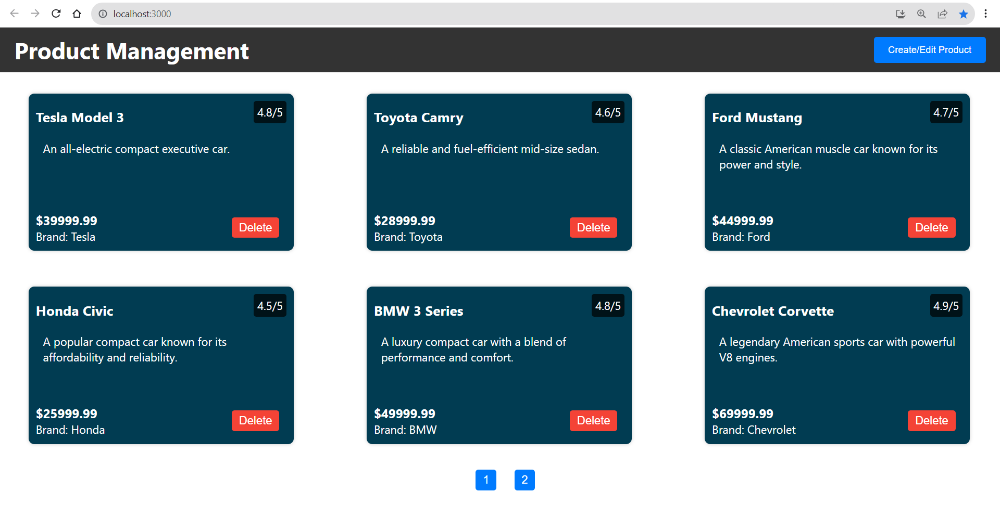

# Product Management MERN stack Application



## Getting Started

These instructions will help you set up and run the project on your local machine.

### Prerequisites

Before you begin, ensure you have met the following requirements:

- [Node.js](https://nodejs.org/) installed on your machine.
- [MongoDB](https://www.mongodb.com/) installed and running locally or on a remote server.

### Installing

1. Clone the repository:

   ```bash
    https://github.com/vimal4dhiman/product-management
   ```

2. Change to the project directory:

   ```bash
    cd product-management
   ```

3. Install server-side dependencies:

   ```bash
    cd server
    npm install
   ```

4. Install client-side dependencies:

   ```bash
    cd client
    npm install
   ```

### Running the Development Server

1.  Start the server:

    ```bash
    cd server
    node app.js
    ```

2.  Start the client:

    ```bash
    cd client
    npm start
    ```

3.  Start the Mongodb

    Start the Mongodb Compass and connect to localhost:27017

---

## The application will run in development mode, and you can access it in your web browser at http://localhost:3000.

### Functionality

1. Product List

- Upon opening the application, you will see a blank page unless you already have some data in the mongodb to start with.
- Each product is displayed as a card, containing details such as title, description, price, rating, and brand.
- The product list can be paginated, and you can navigate through pages to view more products, each page will contain at most 6 product cards.

2. Adding a Product

- To add a new product, click the "Create/Edit Product" button in the header.
- A form will appear, allowing you to enter details for the new product.
- Required fields include product title, description, price, rating (out of 5), and brand.
- Click the "Submit" button to add the product to the list.
- Reload the page and after that product card will be displayed.

3. Updating a Product

- To update an existing product, click the "Create/Edit Product" button in the header.
- A form will appear. To update the product, enter the product same title for updating the same product.
- Click the "Submit" button to update the product.
- Reload the page.
- The updated information will be reflected in the product list.

4. Deleting a Product

- To delete a product, click the "Delete" button on the product card.
- A confirmation dialog will appear to confirm the deletion.
- Click "OK" to delete the product or "Cancel" to cancel the operation.
